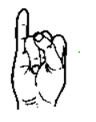

<h1 align="center">Hi 👋, I'm <a href="https://mathieu-lin.github.io/">Mathieu LIN </a>!</h1>

<h2 align="center">👇 My firstname in FSL (French Sign Language) 👇</h2>

   
    <a href="https://github.com/Mathieu-LIN" style="align: center;">
        
        
        
        
        
        
        
    </a> 

<h2 align="center">👇 My lastname in FSL (French Sign Language) 👇 </h2>

   
     

<h2 align="center">👇 Tech Stack 👇</h2>

<h3 align="center">📋 Languages 📋</h3>

<h3 align="center">💻 IDEs/Editors 💻</h3>

<h2 align="center">👇 Contact 👇</h2>

   
    
    

<h2 align="center">👇 GitHub Stats 👇</h2>

    

    

