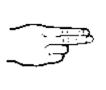

<h1 align="center">Hi, I'm <a href="https://mathieu-lin.github.io/">Mathieu LIN </a>!</h1>

<h2 align="center"> My firstname in FSL (French Sign Language) : </h2>

   
    <a href="https://github.com/Mathieu-LIN">
        
        
        
        
        
        
        
    </a> 

<h2 align="center"> My lastname in FSL (French Sign Language) : </h2>

   
     

### Github Analysts

    

    

